# Secure Networking Tracker

Secure Networking Tracker is a private contact list for people you meet while
networking — name, company, role, where you met them, notes, and a priority
so you know who to follow up with first. It's built for a single signed-in
user managing their own list: every account's contacts are visible and
editable only to that account, enforced by the database itself rather than by
anything in the browser.

## Live application

**URL:** https://secure-networking-tracker-mu.vercel.app

## Screenshots and walkthrough

Screenshots below were captured on the deployed application at the live URL
above, not on a local development server.

**Sign in.** The application's own sign-in form, served from the public Vercel
URL with no Vercel login wall in front of it.

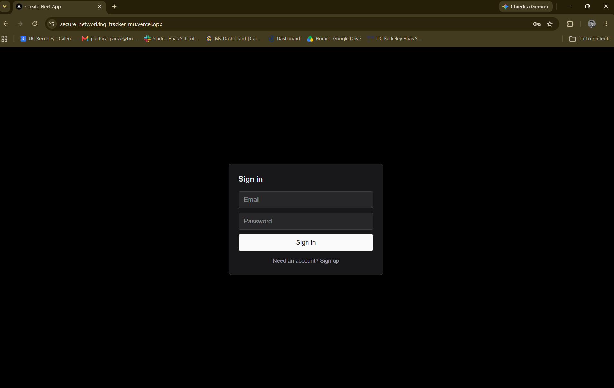

**Signed in.** The contact list, with sort and filter controls and the signed-in
account shown in the header.

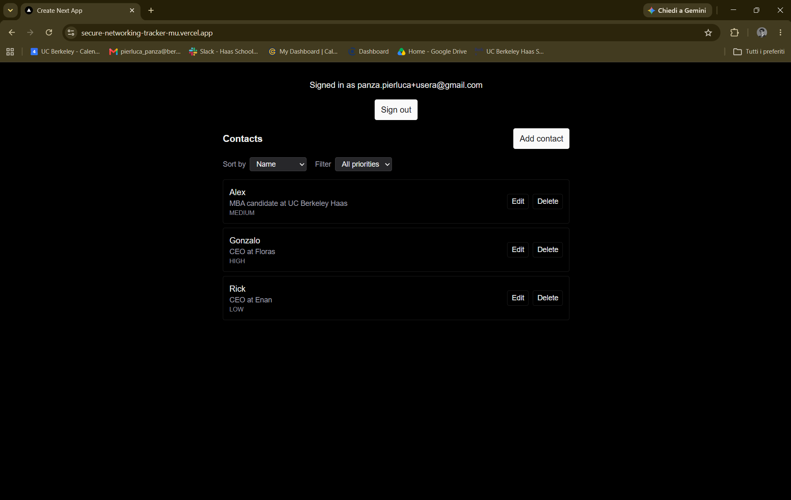

**Create.** A new contact appears in the list immediately — the insert returns
the created row via `.select().single()`, so no refetch is needed.

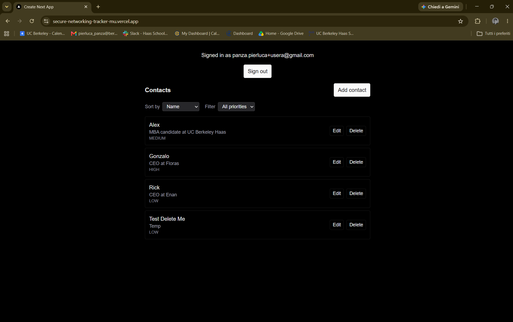

**Edit.** The same contact, updated in place.

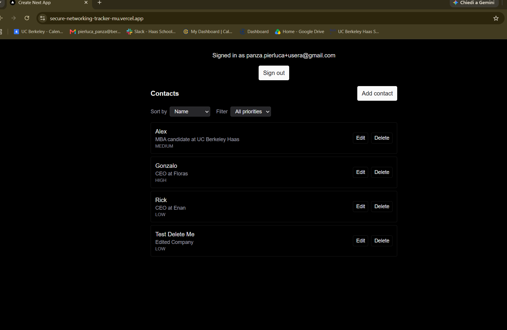

**Survives a refresh.** After a full browser reload, the edit persists — the data
lives in Neon Postgres, not in browser state.

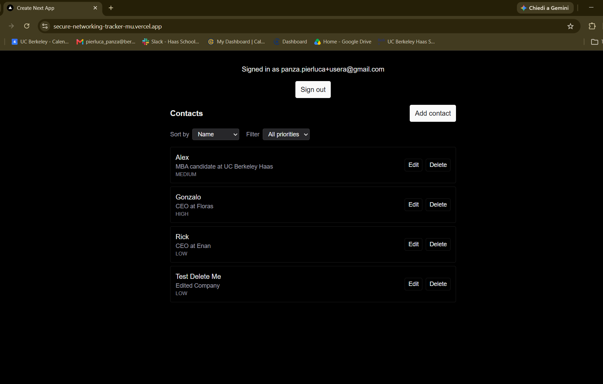

**Delete.** The contact is removed and the list returns to three.

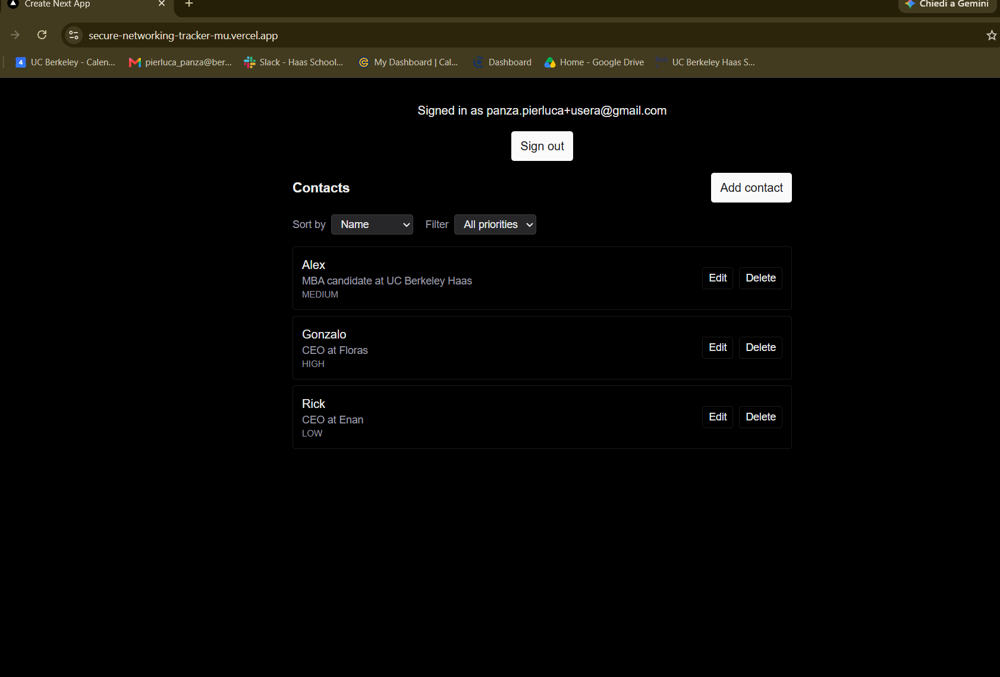

## Features

- Sign up, sign in, and sign out with email and password (Neon Managed Better
  Auth); the session persists across a browser refresh.
- Add a contact with name, company, role, where you met, notes, and a
  high/medium/low priority.
- View, edit, and delete only the contacts you created — every other
  signed-in user's contacts are invisible and unreachable, enforced by
  Postgres Row Level Security, not by the UI.
- Sort by name (A–Z), priority (high → low, not alphabetical), or date added
  (newest first).
- Filter the list by priority.
- Four distinct, reachable UI states: loading, empty ("no contacts yet" vs.
  "no contacts match this filter"), success, and error.
- Responsive layout — usable at phone width and laptop width.
- Invalid input (a blank/whitespace-only name, an invalid priority value) is
  rejected at the database and reported in plain language, not just checked
  in the browser.

## Technology stack and why

The entire stack was specified by the assignment. What follows is what each
piece actually does in this application, and where the mandated choice
happened to fit the problem well.

| Layer | Choice | Why |
|---|---|---|
| Framework | Next.js 16 (App Router) | In practice, the whole app is client components with no custom server route of its own, so App Router mainly supplied the project scaffold and dev server, not anything the app's logic depends on. |
| Database | Neon Postgres | It's also the reason this project's security model works at all: Postgres's Row Level Security is the actual trust boundary the app relies on, not just a "the assignment said so" checkbox. |
| Authentication | Neon Managed Better Auth | It's what issues the signed JWTs that both the Data API and Postgres's `auth.user_id()` trust — that's the specific mechanism that makes per-row ownership possible with no server tier. |
| Data access | Neon Data API via @neondatabase/neon-js | This is the piece that makes "no backend of our own" concrete: it lets the browser query Postgres directly over REST, with the JWT as the only credential, instead of the app writing any server-side query code. |
| Styling | Tailwind CSS | Utility classes kept things like the four UI states and the responsive row layout in `app/contacts.tsx` to small, local class changes instead of separate stylesheet edits. |
| Hosting | Vercel | It's also a plain fit here: `next build`/`next start` with zero custom server code to configure or deploy. |
| Source control | Git + GitHub | The public GitHub repo is itself the graded deliverable. |

## Architecture

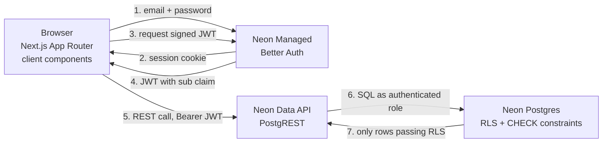

**Frontend.** A Next.js 16 App Router application, styled with Tailwind CSS,
deployed on Vercel. Every component that touches data is a client component.
Vercel serves the application; it runs no application logic of ours and holds no
credentials beyond the two public `NEXT_PUBLIC_` endpoint URLs.

**Backend.** There is no Node server in this application, and that is deliberate.
The backend tier is **Neon Postgres itself**, reached through the Neon Data API —
a PostgREST interface that translates HTTP requests into SQL executed as the
`authenticated` role. Authorization and validation are enforced there, in
database code, not in JavaScript.

**Authentication.** Neon Managed Better Auth verifies credentials and issues a
session. Before each data request, the client exchanges that session for a
short-lived signed JWT, sent as `Authorization: Bearer`. The Data API verifies
the signature before Postgres sees the request, so the browser can neither forge
nor alter it.

**Why this satisfies "frontend and backend separated."**

The separation is not architectural decoration — it is enforced by a boundary the
client cannot cross:

- **Identity is assigned, never asserted.** `contacts.user_id` is
  `text NOT NULL DEFAULT (auth.user_id())`. The client never sends a `user_id`;
  Postgres stamps it from the JWT's `sub` claim at insert time.
- **Authorization is server-side.** Four RLS policies — separate `SELECT`,
  `INSERT`, `UPDATE` and `DELETE` — each compare `auth.user_id()` to the row's
  `user_id`. The `UPDATE` policy carries both `USING` and `WITH CHECK`, so a user
  can neither modify a row they do not own nor use an update to reassign
  ownership.
- **Validation is server-side.** `CHECK (length(btrim(name)) > 0)` and
  `CHECK (priority IN ('high','medium','low'))` run inside Postgres. The form's
  HTML `required` attribute is a convenience, not the guarantee.

The test is what happens when the frontend is removed entirely. An attacker with
`curl`, the public Data API URL and a valid JWT is subject to exactly the same
rules as the UI: they see only their own rows, cannot write a row owned by anyone
else, and cannot insert an empty name or an invalid priority. Nothing that
protects this data lives in the browser bundle.

That is the sense in which the backend is separate: not a different process, but
a different trust domain — one the frontend has no privileged access to.

## Local setup

```bash
git clone https://github.com/PLPSA25/secure-networking-tracker.git
cd secure-networking-tracker
npm install
cp .env.example .env.local   # then fill in your own values
npm run dev
```

`.env.local` is all `npm run dev` needs. A second file, `.env.test.local`, is
only needed to run the integration half of the test suite (`npm test`) — see
Environment variables and Tests below for what goes in it.

## Environment variables

Names only. Never commit real values.

| Variable | Scope | Purpose |
|---|---|---|
| NEXT_PUBLIC_NEON_AUTH_URL | public | Neon Auth endpoint used by the browser client |
| NEXT_PUBLIC_NEON_DATA_API_URL | public | Neon Data API endpoint used by the browser client |
| DATABASE_URL | documented, not used | Listed in `.env.example` as a name only, per the assignment's requirement — never read by this app |
| TEST_USER_EMAIL | test only, in `.env.test.local` | Email for a dedicated, throwaway test-only account, read only by the integration test in `npm test` |
| TEST_USER_PASSWORD | test only, in `.env.test.local` | Password for that same test-only account |

This implementation does not use `DATABASE_URL`, `NEON_AUTH_BASE_URL`, or
`NEON_AUTH_COOKIE_SECRET`, because there is no server tier: the browser talks
directly to Neon Auth and the Neon Data API, so nothing in this app ever opens
a direct Postgres connection or holds a server-side auth session to secure.
Schema changes are applied by hand in the Neon console SQL Editor — see
`db/schema.sql` — rather than through a migration tool that would need
`DATABASE_URL` to run.

## Database schema

The full SQL is in `db/schema.sql`, applied by hand in the Neon console. One
table, `contacts`:

| Column | Type | Constraint | What it enforces |
|---|---|---|---|
| `id` | `bigint` | `GENERATED BY DEFAULT AS IDENTITY`, `PRIMARY KEY` | Unique row id, assigned by Postgres on insert — the app never sends one. |
| `user_id` | `text` | `NOT NULL`, `DEFAULT (auth.user_id())` | Owner of the row, filled in from the caller's JWT at the moment of insert — the app never sends this either. See "Authentication and row ownership" below for how this, plus the four RLS policies, is what actually keeps one user's contacts away from another's. |
| `name` | `text` | `NOT NULL`, `CHECK (length(btrim(name)) > 0)` | Rejects a blank or whitespace-only name — `btrim` strips leading/trailing whitespace before the length check, so `"   "` fails even though it isn't literally an empty string. |
| `company` | `text` | none | Optional; stored as `NULL` when left blank. |
| `role` | `text` | none | Optional; stored as `NULL` when left blank. |
| `where_met` | `text` | none | Optional; stored as `NULL` when left blank. |
| `notes` | `text` | none | Optional; stored as `NULL` when left blank. |
| `priority` | `text` | `NOT NULL`, `CHECK (priority IN ('high', 'medium', 'low'))` | Rejects any value other than exactly these three strings — the app's own `<select>` only offers these three, but this is the constraint that actually matters; the `<select>` is UX, not enforcement. |
| `created_at` | `timestamptz` | `NOT NULL`, `DEFAULT now()` | Set once, at insert, by Postgres. |
| `updated_at` | `timestamptz` | `NOT NULL`, `DEFAULT now()` | Only defaults at insert — there is no trigger that updates it automatically. `updateContact` in `lib/contacts.ts` sets it explicitly on every edit, since nothing else would. |

`ROW LEVEL SECURITY` is enabled on `contacts`, with four separate policies
(select, insert, update, delete) — see "Authentication and row ownership"
below for what each one does and why the update policy needs both `USING` and
`WITH CHECK`.

## Authentication and row ownership

When someone clicks **Sign in**, the browser sends their email and password
directly to the Neon Auth service at `NEXT_PUBLIC_NEON_AUTH_URL` — there is no
server of ours in between. Neon Auth checks the password, creates a session,
and the browser ends up holding that session as a cookie. The app watches that
session reactively, which is why the screen switches from the sign-in form to
the contacts page on its own, with no manual refresh.

That session cookie is not what talks to the database, though. Every time the
app needs to read or write a contact, the Neon client asks Neon Auth for a
short-lived, signed **JWT** built from the current session, and attaches it to
the request to the Data API as `Authorization: Bearer <token>`. The JWT is
never written to localStorage or to disk — it lives only in memory for the
length of one request, and a fresh one is fetched next time. The browser
cannot alter or forge this token: it is signed with Neon Auth's private key,
and the Data API verifies that signature before trusting anything inside it.

Every JWT carries a `sub` ("subject") claim, which is just the signed-in
user's id. When the Data API forwards a request to Postgres, the JWT goes with
it. A SQL function, `auth.user_id()`, reads the `sub` claim out of the current
request's JWT and returns it as plain text — that function is the single place
in the whole system where "the person making this request" becomes "a value
Postgres can compare against." Everything below only ever compares things to
what that function returns.

Two parts of the schema lean on it:

- `contacts.user_id` is declared `text NOT NULL DEFAULT (auth.user_id())`. It's
  `text`, not `uuid`, because that's exactly the type `auth.user_id()` returns
  — matching types means every policy comparison below is a plain equality
  check, with no implicit cast that could silently behave oddly. The default
  means Postgres fills in the owner itself, from the JWT, at the moment a row
  is inserted. The app's code never sends `user_id` on an insert.
- Four separate Row Level Security policies each compare `auth.user_id()` to a
  row's `user_id`:
  - **SELECT** — a row is only returned if `auth.user_id() = user_id`. This is
    why one user's contacts are invisible to another: Postgres filters rows
    out before they ever reach the Data API response, no matter what the query
    asked for.
  - **INSERT** — the new row is only allowed to be written if
    `auth.user_id() = user_id` once the default has filled `user_id` in. This
    is what stops a client from claiming a contact under someone else's id,
    even if it tried to send one explicitly.
  - **DELETE** — a row can only be deleted if `auth.user_id() = user_id`,
    checked against the row that already exists.
  - **UPDATE** — this is the one that needs both `USING` and `WITH CHECK`,
    because they check two different moments. `USING` is checked against the
    row *as it exists before the update* — it decides which existing rows
    you're even allowed to touch. `WITH CHECK` is checked against the row *as
    it would exist after the update* — it decides whether the values you're
    about to write are still allowed. Without `WITH CHECK`, someone could pass
    the `USING` check on a row they own and then use the update itself to
    rewrite `user_id` and hand the row to someone else. With both, you can
    only update rows you already own, and you can never use an update to
    reassign ownership.

None of this depends on the React code behaving itself. If a bug in the UI
ever sent a malformed request, or someone bypassed the browser and called the
Data API directly, the result would be identical: these four policies and the
`user_id` default are the only reason any of this holds, and they hold at the
database, not in JavaScript.

## Tests

```bash
npm test
```

There are two kinds of test, and they run together under one `npm test`:

- **Unit tests** (`tests/contact-errors.test.mjs`) for `translateContactError` —
  no network, no auth, always run.
- **An integration test** (`tests/contacts.integration.test.mjs`) that signs in
  as a real (test-only) account and attempts two inserts directly against the
  Data API: a whitespace-only name, and an invalid `priority` value. It asserts
  the database itself rejects both — a non-null error identifying
  `contacts_name_check` or `contacts_priority_check` — and cleans up if a row
  is ever returned unexpectedly, so a regression can't leave data behind.

**What the integration test proves, and what it doesn't.** It proves the two
CHECK constraints reject bad input at the database, which is the point of
Stage 6: the enforcement is real, not just client-side string matching. It
does **not** test Row Level Security isolation between users — that's verified
manually with two accounts (see Security evidence below), because it requires
two separate signed-in identities and is easier to demonstrate directly than
to script safely against real accounts.

**Credentials, and what happens without them.** The integration test needs a
signed-in session — every RLS policy on `contacts` is scoped `TO authenticated`,
so an unauthenticated request can't reach the CHECK constraints at all, only a
row-level-security rejection. Its credentials go in `.env.test.local`
(gitignored, not `.env.local`) as `TEST_USER_EMAIL` and `TEST_USER_PASSWORD` —
see `.env.example` for the names. That account is a dedicated, throwaway
test-only user, never used for the demo data captured as grading evidence. If
those variables aren't set, the two integration tests are reported as
**skipped**, with the reason printed, and `npm test` still exits successfully —
it only ever fails if credentials are present but wrong, or a constraint stops
enforcing what it should.

**Why the test needs its own Origin header and cookie handling.** Neon Auth
enforces origin checking, and a browser sends an `Origin` header (and carries
session cookies between requests) automatically; Node's `fetch` does neither.
`tests/contacts.integration.test.mjs` patches `globalThis.fetch`, scoped to
that one test file only, to add `Origin: http://localhost:3000` and replay the
session cookie from sign-in on later requests — `lib/neon.ts` is untouched,
since the real app runs in a browser and needs none of this. For the
integration test to sign in at all, `http://localhost:3000` must be listed
among the trusted origins in the Neon Auth project settings.

**Node version.** The app itself runs on Node 20.9+ (Next.js 16's own
requirement). The test suite needs Node 22.6+, because it runs `.ts` source
files directly and relies on Node's native TypeScript stripping, which doesn't
exist before 22.6. That's a real, narrower floor than the app's — stated here
rather than left to overstate or understate what running `npm test` requires.

## Security evidence

### Two-account privacy test

Two different signed-in accounts, side by side in the same screenshot: User A on
the left, User B on the right, each showing their own contacts and none of the
other's.

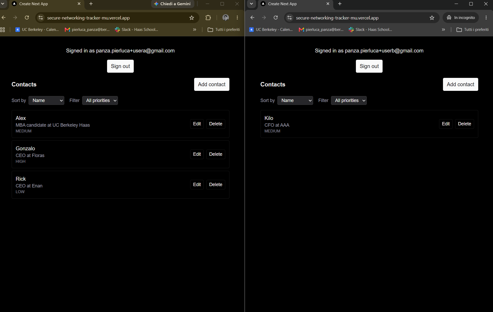

**There is no error message in this screenshot, and that is the point.** Row
Level Security filters unauthorized rows inside Postgres, before the Data API
ever builds a response. User B's query for `contacts` is a perfectly valid,
successful request that simply returns none of User A's rows — the rows are
invisible, not forbidden. A permission error would mean the rows had been
reached and then refused; an empty result means they were never in scope.

### Invalid input fails safely

A whitespace-only name. The browser's `required` attribute does not block it —
`"   "` is not an empty field — so the request reaches Postgres, where
`CHECK (length(btrim(name)) > 0)` rejects it. The raw constraint violation is
translated into plain language before it reaches the user.

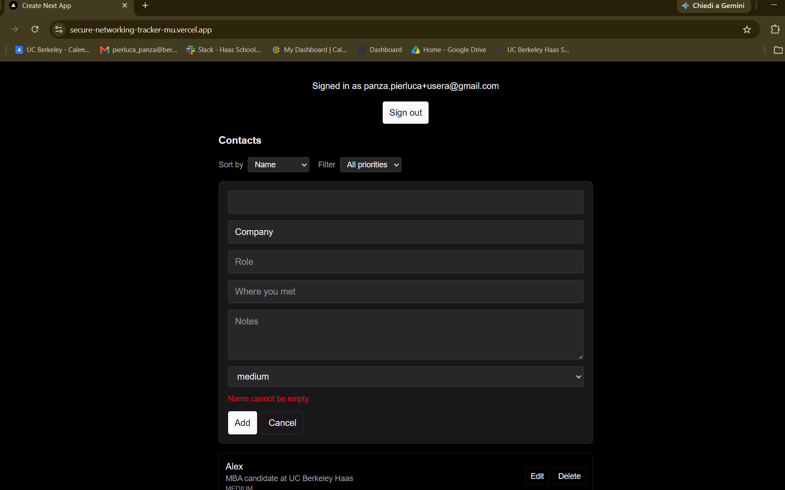

### Four separate Row Level Security policies

The rubric requires separate `SELECT`, `INSERT`, `UPDATE` and `DELETE` policies
rather than a single `FOR ALL`. Queried live against the production branch:

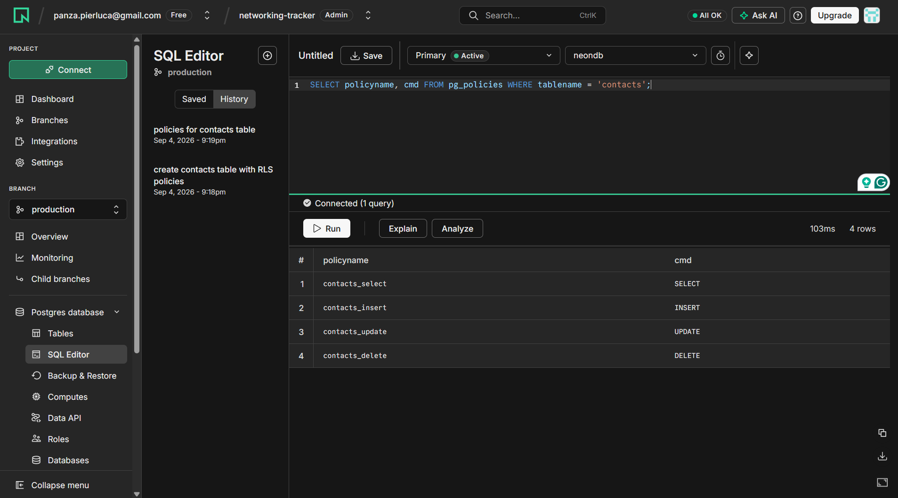

### Automated tests

`npm test` — unit tests for the error translator plus two integration tests that
sign in as a dedicated test-only account and confirm the database rejects a
blank name and an invalid priority.

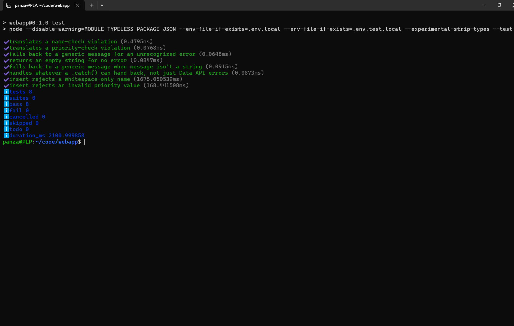

### No secrets committed

`.env.local` and `.env.test.local` are gitignored; only `.env.example`, which
holds placeholder values, is tracked. Verify with:

```bash
git ls-files | grep -i env
```

The only result is `.env.example`. `DATABASE_URL` is never read by the
application and holds no value in any committed file.

## Deployment

Hosted on Vercel, connected to this repository. Any push to `main` triggers a
production deployment automatically; there is no build step to run by hand.

To deploy a fresh copy:

1. **Import the repository into Vercel.** The Next.js preset is detected
   automatically and needs no changes.
2. **Set the two public environment variables** in the Vercel project, for the
   Production environment: `NEXT_PUBLIC_NEON_AUTH_URL` and
   `NEXT_PUBLIC_NEON_DATA_API_URL`. Vercel will offer to pre-fill every key it
   finds in `.env.example` — remove `DATABASE_URL`, `TEST_USER_EMAIL` and
   `TEST_USER_PASSWORD`, which this application does not use and which have no
   place on a public deployment. Verify the two remaining values are the real
   endpoints and not the angle-bracket placeholders from `.env.example`.
3. **Add the deployed domain to Neon Auth's trusted domains**
   (Neon console → Auth → Configuration → Domains), with scheme and no trailing
   slash: `https://secure-networking-tracker-mu.vercel.app`. This governs where
   Neon Auth will redirect after authentication.
4. **Confirm Vercel Deployment Protection is off** for Production. If Vercel
   Authentication is enabled, visitors hit a Vercel login wall instead of the
   application — and the deployment looks fine to the project owner, who is
   already signed in.
5. **Apply the schema.** The `contacts` table, its constraints and its four RLS
   policies are not created by the application. Run `db/schema.sql` in the Neon
   console SQL Editor against the target branch, then confirm with
   `SELECT policyname, cmd FROM pg_policies WHERE tablename = 'contacts';` —
   four rows, one per command.
6. **Verify in a private browser window.** Signed out of Vercel and holding no
   cookies, a visitor should reach the application's own sign-in form and be
   able to create an account. This is the check that catches step 4.

## Known limitations and what I would improve next

- **Auth errors are shown verbatim, which allows account enumeration.**
  Sign-up/sign-in show Neon Auth's own error text as-is (e.g. "Email address
  already registered" vs. "Invalid email or password"), so an attacker can
  learn whether an email has an account by attempting to sign up with it. The
  standard mitigation is a neutral response ("If that email isn't already
  registered, check your inbox") paired with mandatory email verification —
  but email verification is currently disabled on this Neon Auth project, so
  a neutral message today would just leave a legitimate user with a wrong
  password stuck with no explanation. I'm treating this as a considered
  trade-off for now, not an oversight: fix it together with verification, not
  separately.
- **A Data API error's `.details` field can carry Postgres detail or a raw
  stack trace.** Nothing in this app reads that field today — every error
  path goes through `translateContactError`'s allowlist, which only ever
  looks at `.message` — but a future debug `console.error(error)` would leak
  it straight to the browser console. Worth a lint rule or a wrapper that
  strips `.details` before an error object is ever allowed to reach a
  `console.*` call.
- **`user_id` is kept out of insert/update payloads by TypeScript types, not
  by a runtime check.** `ContactInput`/`ContactUpdate` simply have no
  `user_id` field, so nothing today can send one — but that's a type-checker
  guarantee, not a runtime one. The real protection is the database's own
  `WITH CHECK (auth.user_id() = user_id)` on both the insert and update
  policies, which would reject a spoofed value regardless of what the client
  sends. A future refactor could still introduce a code path that spreads
  unvalidated data into an insert without the type checker catching it; a
  runtime strip (e.g. `delete payload.user_id` before every call) would close
  that gap independent of the type layer.
- **Switching which contact is being edited discards another contact's
  unsaved edit with no warning.** Only one contact can be in edit mode at a
  time; opening a second one silently unmounts the first form, reverting to
  its saved values. A confirmation prompt (or just disabling other rows' Edit
  buttons while one is open) would fix this; skipped for now since it's a
  narrow, low-consequence case.
- **Client-side sorting and filtering don't scale.** `app/contacts.tsx` fetches
  the full contact list and sorts/filters it in the browser. Fine for a
  personal contact list of a few hundred rows; would need to move to
  `.order()`/`.eq()` on the Data API query itself (and a priority-ranking
  approach that doesn't rely on alphabetical order) if this were ever meant to
  hold thousands of contacts.
- **Every Data API call costs an extra `/get-session` round trip.** The SDK
  resolves a fresh JWT on every single request rather than caching one for
  its lifetime (verified directly in `@neondatabase/auth`'s source — see
  "Authentication and row ownership" above). Fine at this app's scale; would
  be worth caching the token client-side until it's near expiry if request
  volume ever became a concern.
- Neon's auth packages are beta releases (@neondatabase/auth 0.5.0-beta,
  @neondatabase/neon-js 0.7.0-beta). Several behaviors in this project were
  found to diverge from the SDK's own documented examples — most notably,
  `signIn.email`/`signUp.email` throw on failure instead of returning
  `{ data, error }` as documented — and were only caught by testing directly
  against the live endpoints rather than trusting the docs.
